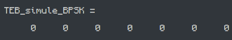
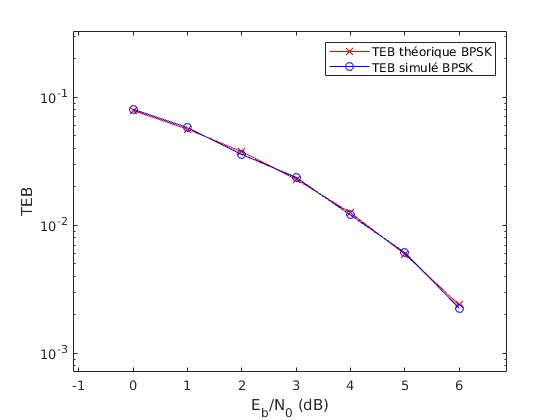
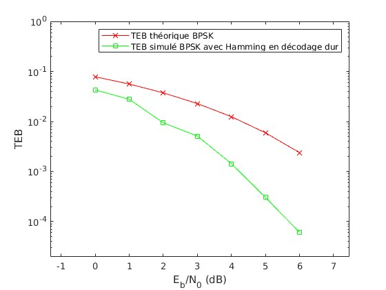
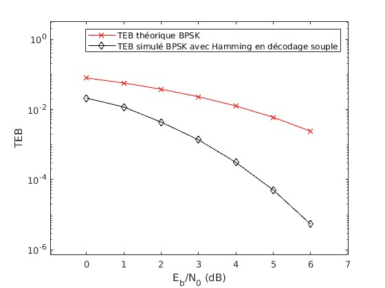
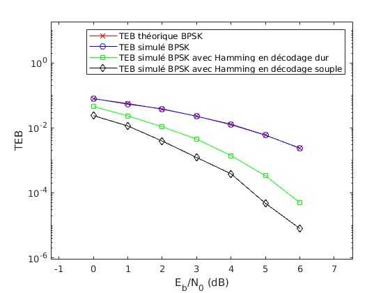
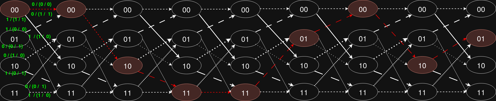
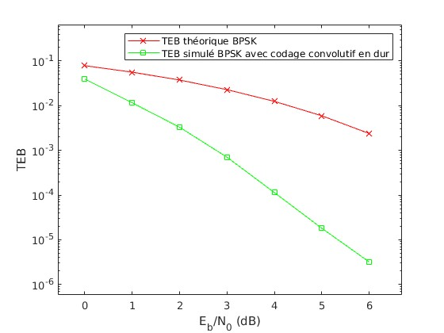
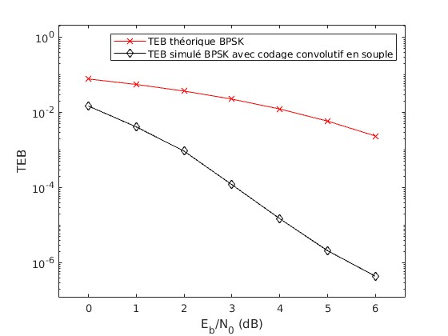
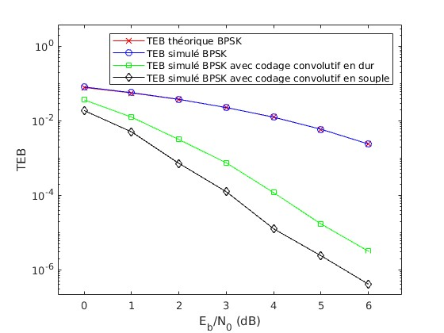

**Remarque :** Fichier engendré avec:

~~~
pandoc -o rapport-demesy_rabefaniraka.pdf rapport-demesy_rabefaniraka.md --highlight=my_style.theme
~~~

\newpage

# Introduction

Le codage canal est l'ajout selon une loi donnée de redondance d'information au sein de notre transmission. Cela sert à minimiser les erreurs de transmission en vérifiant à la réception que la loi de codage utilisée par l'émetteur a bien été respectée.

L'objectif de ce projet est d'étudier l'impact de l'ajout du codage canal sur l'efficacité spectrale et l'efficacité en puissance d'une chaîne de transmission.

Pour ce faire, seront implémentées le **codage en bloc linéaires** avec le *code de Hamming*, puis le **codage convolutif** avec *l'algorithme de Viterbi*.

# Pré-requis (Transmission passe-bas équivalente BPSK)

Les implémentations seront limitées à une modulation binaire (éléments se trouvant dans {$0,1$}). On utilisera plus spécifiquement un mapping ***BPSK*** (ici c'est équivalent à un mapping 2-ASK avec deux valeurs opposées sur l'axe des réels), pour un débit binaire de $3000bits/sec$, avec une fréquence d'échantillonnage de 12kHz. On choisira un filtre de mise en forme et de réception rectangulaire de durée Ts.

## Validation de la chaîne de transmission

Avec $n_0 = 4$, on remarque que notre chaîne de transmission sans bruit a bien un TEB nul.



Là où, avec bruit, il se rapproche bien du TEB théorique pour un mapping binaire BPSK.

{ width=58% }

# Implémentation en codes àn bloc linéaires

Le code de Hamming crée de la redondance en associant à un **mot d'information** de *k* éléments binaires $i = [i_0...i_{k-1}]$, un **mot de code** de *n* éléments binaires $c = [c_0..;c_{n-1}]$ (évidemment $k < n$). On obtient ce mot de code à l'aide d'une matrice génératrice de taille $k\times n$ appelée G. Elle est l'expression dans la base d'arrivée de l'image de l'application $i \rightarrow c = g(i)$.

Ici, ce code est implémenté en groupant d'abord les bits de départ en blocs de 4 bits d'information, puis en les multipliant par la matrice génératrice $G$ pour obtenir des mots codés de 7 bits (*i.e.* $c = iG$), ajoutant ainsi la redondance nécessaire.

À la réception, à partir du code reçu $c'$, on décide du mot de code émis le plus vraisemblable en utilisant une règle du **maximum de vraisemblance**: 
Pour cela, on établit une distance entre le mot de code reçu et tous les mots de code possibles dans un dictionnaire; le mot le plus plausible est donc celui qui maximise notre critère de vraisemblance, c'est-à-dire celui qui minimise sa distance avec le mot reçu.

On a deux distances différentes selon le décodage:

## Cas du décodage dur

Le **décodage dur** calcule une *distance de Hamming* entre les bits reçus et ceux possibles. Cette distance est définie comme étant le nombre de bits de même rang mais différents. Ici, le décodage est essentiellement implémenté comme suit:

```matlab
distance_hamming = sum(code_mots ~= mot_courant, 2);
[~, index_min] = min(distance_hamming); %min retourne l'indice en 2eme pos
bits_decodes_BPSK_hamming_dur(i, :) = dico_mots(index_min, :);
```

On obtient le tracé du TEB suivant:

{ width=58% }

## Cas du décodage souple

Le **décodage souple** calcule une *distance euclidienne* entre les **symboles** reçus et ceux possibles. Ici, le décodage est essentiellement implémenté comme suit:

```matlab
mot_courant = Signal_echantillonne_BPSK_hamming_reshaped(i, :);
distance_euclidienne = pdist2(mot_courant, code_mots, 'euclidean');
[~, index_min] = max(distance_euclidienne);
bits_decodes_BPSK_hamming_souple(i, :) = dico_mots(index_min, :);
```

On obtient le tracé du TEB suivant:

{ width=58% }

## Impact du codage canal de Hamming

On peut observer les différents tracés:

{ width=58% }

On remarque que la correction des erreurs introduites par le bruit gaussien permet, pour un même ***SNR*** ($E_b / N_0$), d'atteindre un ***TEB*** significativement plus bas pour les méthodes de codage canal. On s'approche même d'un $TEB \approx 10^{-5}$ pour un $SNR_{dB} = 6 dB$ pour le décodage souple avec notre mapping BPSK.

Ainsi, on peut conclure en premier lieu que le SNR nécessaire à l'entrée du récepteur pour obtenir un TEB donné est plus faible avec le codage canal qu'en son absence; d'où par définition l'**efficacité en puissance** se voit améliorée.

Pour autant, la *bande de fréquence* nécessaire pour transmettre un *débit binaire* donné est donc plus grande puisque s'ajoutent aux bits initiaux, les bits de redondance générés par le codage de Hamming. Alors, l'**efficacité spectrale** est réduite.

# Implémentation en codes convolutifs

Le codage convolutif génère de la redondance en faisant passer les bits d'information à travers un ensemble de **registres à décalage** (ici un seul) connectés à des *générateurs* qu'on convolue avec nos entrées. On obtient donc en sortie deux bits:

- Le premier est $s_{n_1} = b_{n} \bigoplus b_{n-2}$
- Le second est $s_{n_2} = b_{n} \bigoplus b_{n-1} \bigoplus b_{n-2}$

On peut aussi écrire en généralisant que $s_{n_i} = \sum_{j=0}^{K-1} g_i(j) \, b_{k-j}$, où g est un générateur de code convolutif.

Aussi, à l'inverse du codage en bloc qui traite des mots isolés, le codage convolutif opère de manière **continue** sur le flux de données.

Ici, il est implémenté avec un *rendement* de $1/2$ et de *longueur de contrainte* $K=3$, utilisant deux générateurs :

- $g_1 = 1 + D^2$ (*représentation octale* : $5_{octal}$; *représentation en vecteur de coefficients binaires*: $[1 0 1]$)
- $g_2 = 1 + D + D^2$ (*représentation octale* : $7_{octal}$; *représentation en vecteur de coefficients binaires*: $[1 1 1]$)

Ainsi, pour la suite de bits $[0 1 1 1 0 0 1 0]$, on a:

Bit | [$b_{n-1}$ $b_{n-2}$] | $s_{n_1}$  | $s_{n_2}$  | Sortie
----|----------------------|------------|------------|--------
0   | [0 0]                | 0+0 = 0    | 0+0+0 = 0  | [0 0]
1   | [0 0]                | 1+0 = 1    | 1+0+0 = 1  | [1 1]
1   | [1 0]                | 1+0 = 1    | 1+1+0 = 0  | [1 0]
1   | [1 1]                | 1+1 = 0    | 1+1+1 = 1  | [0 1]
0   | [1 1]                | 0+1 = 1    | 0+1+1 = 0  | [1 0]
0   | [0 1]                | 0+1 = 1    | 0+0+1 = 1  | [1 1]
1   | [0 0]                | 1+0 = 1    | 1+0+0 = 1  | [1 1]
0   | [1 0]                | 0+0 = 0    | 0+1+0 = 1  | [0 1]

Ainsi on devrait avoir en sortie: $[00 11 10 01 10 11 11 01]$.

Le treillis associé à un décodage de Viterbi avec décisions dures pour cette suite de bits, en supposant qu'il n y a pas de canal de transmission, est alors:



Avec pour chemin:

$00 \rightarrow 00 \rightarrow 10 \rightarrow 11 \rightarrow 11 \rightarrow 01 \rightarrow 00 \rightarrow 10 \rightarrow 01$


Il est à noter que par manque de temps et de puissance cérébrale (plus de jus), les fonctions *Matlab* par défaut (*convenc, poly2trellis, vitdec*) ont été utilisées pour l'implémentation.

Chaque bit d'information génère deux bits codés, doublant ainsi le débit transmis. Le codeur possède une **mémoire** de $m = K-1 = 2$ bits stockés dans des registres à décalage.

À la réception, l'**algorithme de Viterbi** est utilisé pour décoder en recherchant le chemin le plus vraisemblable (**maximum de vraisemblance**) dans le treillis des états possibles. On dispose de deux types de décodage :

## Cas du décodage dur (Viterbi)

Le **décodage dur** utilise une *distance de Hamming* entre les bits reçus et les transitions possibles du treillis. Le décodage est implémenté comme suit:

```matlab
bits_decodes_BPSK_conv_dur = vitdec(bits_recus_BPSK_conv, treillis, 5*3, 'trunc', 'hard');
```

On obtient le tracé du TEB suivant:

{ width=58% }

## Cas du décodage souple (Viterbi)

Le **décodage souple** utilise une *distance euclidienne* en exploitant directement les **symboles** reçus avant décision. Le signal analogique est quantifié sur $L = 3$ bits puis traité par l'algorithme :

```matlab
L = 3;
dist_souple = round(((1 - Signal_echantillonne_BPSK_conv) / 2) * (2^L - 1));
bits_decodes_BPSK_conv_souple = vitdec(dist_souple, treillis, 5*3, 'trunc', 'soft', L);
```

On obtient le tracé du TEB suivant:

\begin{figure}[H]
    \centering
    \includegraphics[width=0.5\textwidth]{img/TEB_simule_BPSK_conv_souple.jpg}
    \vspace{-5pt}
    \caption[schema]{Tracé du TEB avec codage convolutif et algorithme de Viterbi en décodage souple}
    \label{fig:tts}
\end{figure}

<!-- { width=58% } -->


## Impact du codage canal convolutif

On peut observer les différents tracés:

{ width=58% }

L'analyse de l'impact de cette implémentation du codage canal sur les efficacités est peu ou prou le même que pour le code de Hamming:

Grâce à la correction d'erreurs du code convolutif, pour un même ***SNR*** ($E_b / N_0$), le *TEB* atteint est significativement plus bas pour les méthodes de codage canal. On observe par ailleurs que le décodage souple obtient encore des résultats de TEB bien supérieurs au décodage dur, puisque pour $SNR_{dB} = 6dB$ on a $TEB \approx 10^{-6}$.

Ainsi, ce codage canal améliore aussi l'**efficacité en puissance**.

Pour autant, pour chaque bit en entrée on en génère deux; la *bande de fréquence* nécessaire pour transmettre un *débit binaire* donné est donc encore une fois plus grande. Ici, elle semble même être deux fois plus grande puisque pour chaque bit d'entrée en sortent deux. Alors, l'**efficacité spectrale** est réduite.

# Comparaison des implémentations

En comparant les tracés des différents TEBs, on remarque vite que le code convolutif a des *performances supérieures* au codage de Hamming en terme d'efficacité en puissance: En effet, pour un même ***SNR*** ($E_b/N_0 = 6$ dB), le code convolutif avec décodage souple atteint un $TEB \approx 10^{-6}$, tandis que le code de Hamming avec décodage souple n'atteint qu'un $TEB \approx 10^{-5}$. 
On pourrait expliquer cela par le fait que la mémoire du code convolutif utilise la corrélation entre bits successifs sur un flux continu, là où le code de Hamming travaille sur des blocs de bits "indépendants" en une traite.

Ensuite, en partant du postulat que la bande de fréquence est bel et bien $2$ fois plus grande pour le code convolutif, son efficacité spectrale est donc moins bonne que le code de Hamming: Ce dernier fait passer des blocs de 4 bits à 7 bits avec la redondance, soit "seulement" $1.75$ fois plus de bits à transmettre que sans codage canal.

Ainsi, là où le code convolutif est largement plus intéressant pour son efficacité en puissance, le code de Hamming garde une meilleure efficacité spectrale.

# Conclusion

En implémentant le codage canal de deux manières différentes, on constate que le gain en efficacité en puissance de notre transmission est significatif: Le taux d'erreur est largement inférieur au taux théorique pour un SNR donné, en particulier pour le code convolutif qui dépasse de loin le codage de Hamming.

Cependant, l'ajout de redondance par ce dernier dégrade certes l'efficacité spectrale en augmentant le nombre de bits à transmettre, mais ce nombre est amoindri par rapport à l'ajout du code convolutif; Dès lors, la $1^{ère}$ implémentation a une meilleure efficacité spectrale que la $2^{ère}$.

Ainsi, le codage canal nous offre une méthode optionnelle de transmission d'information supplémentaire selon les besoins de la situation, selon si on veut prioriser une meilleure efficacité en puissance et donc abaisser le SNR nécessaire en entrée pour un TEB donné, ou si on veut prioriser une meilleure efficacité spectrale et donc économiser la bande de fréquence nécessaire pour transmettre un débit binaire donné. Cela inclut aussi le fait de ne pas s'en servir si la situation se satisfait du TEB théorique mais nécessite de réduire la bande de fréquence minimale.

# Références (liens à cliquer)

- [Fonction Matlab *convenc* pour le code convolutif](https://fr.mathworks.com/help/comm/ref/convenc.html)
- [Fonction Matlab *vitdec* pour l'algorithme de Viterbi](https://fr.mathworks.com/help/comm/ref/vitdec.html)

